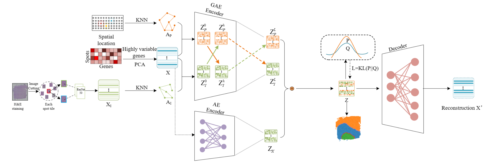

# XVGAE

## Installation
```bash
pip install git+https://github.com/LiminLi-x]Tu/XVGAE.git
```
## Requirements
* Python 3.9
* torch 1.13.0+cu116
* scanpy 1.9.1
* anndata 0.8.0
* louvain 0.8.0
* numpy 1.22.4
* scikit-learn 1.0.2
* pandas 1.3.5
* munkres 1.1.4
* tqdm 4.64.1
## Data
In order to save running time, we have extracted the histological image features and saved them in the data folder in CSV format.
```bash
data
   |-151507
   |-151508
    ...
   |-151669
        |-spatial
            |-scalefactors_json.json
            |-tissue_hires_image.png
            |-tissue_lowres_image.png
            |-tissue_positions_list,csv
            |-tissue_positions_list.txt
        |-151669_filtered_feature_bc_matrix.h5
        |-151669truth.csv
        |-151669128_0.5_200_12_simCLR_reprensentation2.csv
```
## Usage
```python

# load data
adata = sc.read_visium(path=load_path, count_file=opt.args.name+'_filtered_feature_bc_matrix.h5')
X=get_process(adata,pca_n=50)

# adj spatial
A = adj(adata,view='gene',model='Radius')
A = normalize_adj(A)
A = torch.FloatTensor(A).to(device)

# adj image feature
datai = np.loadtxt( load_path+opt.args.name+"128_0.5_200_12_simCLR_reprensentation2.csv",delimiter=",")
pca = PCA(n_components=100)
image_spatial=pca.fit_transform(datai)
adata.obsm['image_spatial']=image_spatial
Ai = adj(adata,view='image',model='KNN')
Ai = normalize_adj(Ai)
Ai = torch.FloatTensor(Ai).to(device)

# Create Model and Train
model = XVGAE(n_node=X.shape[0]).to(opt.args.device)
pretrain(model, X, y, A, Ai)
train(model,X, y, A, Ai)
```
