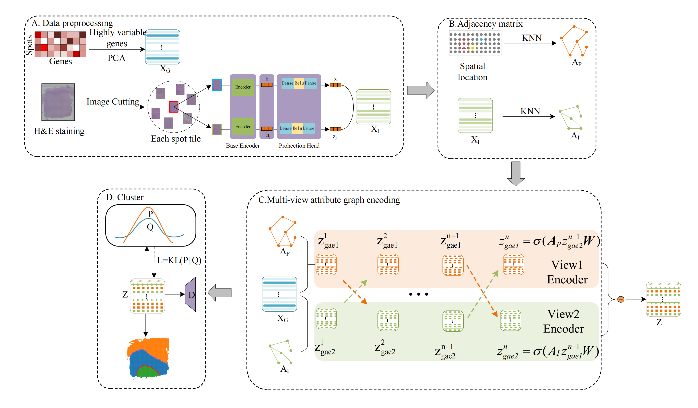

# XVGAE
## Overview

XVGAE is an innovative cross-view graph autoencoder that integrates gene expression, spatial locations, and histological images to identify spatial domains effectively. By constructing a spatial graph and a histological graph from the spatial locations and histological images, respectively, the XVGAE learns view-specific representations and propagates the view-specific information mutually by two cross-view graph convolutional networks. XVGAE enhances clustering accuracy, as demonstrated in benchmark studies on the human dorsolateral prefrontal cortex. Additionally, it demonstrates superior performance in identifying biologically significant spatial domains across various spatial transcriptomics datasets from different sequencing platforms.

## Installation
```bash
pip install git+https://github.com/LiminLi-xjtu/XVGAE.git
```
## Requirements
* Python 3.8.18
* torch 2.1.1 (CUDA 12.1)
* torchaudio 2.1.1
* torchvision 0.16.1
* scanpy 1.9.6
* anndata 0.9.2
* louvain 0.8.1
* numpy 1.24.4
* scikit-learn 1.0.2
* pandas 2.0.3
* munkres 1.1.4
* tqdm 4.66.1

## Data
In order to save running time, we have extracted the histological image features and saved them in the data folder in CSV format.
```bash
data
   |-151507
   |-151508
    ...
   |-151669
        |-spatial
            |-scalefactors_json.json
            |-tissue_hires_image.png
            |-tissue_lowres_image.png
            |-tissue_positions_list,csv
            |-tissue_positions_list.txt
        |-151669_filtered_feature_bc_matrix.h5
        |-151669truth.csv
        |-151669128_0.5_200_12_simCLR_reprensentation2.csv
```
## Usage
```python

# load data
adata = sc.read_visium(path=load_path, count_file=opt.args.name+'_filtered_feature_bc_matrix.h5')
X=get_process(adata,pca_n=50)
X = torch.FloatTensor(X).to(device)
# adj spatial
A = adj(adata,view='gene',model='Radius',rad_cutoff=150,k_cutoff=8)
A = normalize_adj(A)
A = torch.FloatTensor(A).to(device)

# adj image feature
datai = np.loadtxt( load_path+opt.args.name+"128_0.5_200_12_simCLR_reprensentation2.csv",delimiter=",")
pca = PCA(n_components=100)
image_spatial=pca.fit_transform(datai)
adata.obsm['image_spatial']=image_spatial
Ai = adj(adata,view='image',model='KNN',rad_cutoff=150,k_cutoff=8)
Ai = normalize_adj(Ai)
Ai = torch.FloatTensor(Ai).to(device)

# Create Model and Train
model = XVGAE(n_node=X.shape[0]).to(opt.args.device)
pretrain(model, X, y, A, Ai)
train(model,X, y, A, Ai)
```
## 
You can find other data and pretrain.pkl to reproduce the result：
